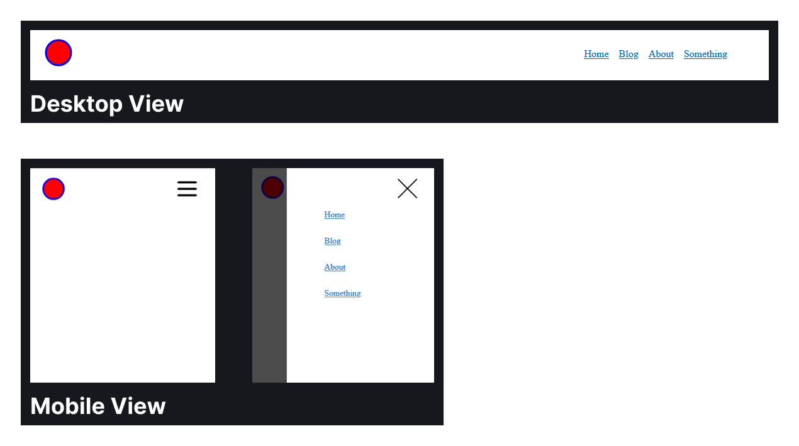

import { Tabs, TabItem } from '@astrojs/starlight/components';

How to make a accessibility-friendly responsive navigation bar using HTML, CSS and JavaScript.

## Building a Responsive Navigation Bar

A responsive navigation bar is essential for the majority of sites.



Below is a working example of the navigation bar. On large screen it shows all navigation links directly, on smaller screens it hides them behind a hamburger menu.

<iframe height="500" style="width: 100%; height: 500px;" scrolling="no" title="Responsive Header Navigation" src="https://codepen.io/BryanHogan/embed/ByBWYab?default-tab=html%2Cresult" frameborder="no" loading="lazy" allowtransparency="true" allowfullscreen="true">
  See the Pen <a href="https://codepen.io/BryanHogan/pen/ByBWYab">
  Responsive Header Navigation</a> by Bryan Hogan (<a href="https://codepen.io/BryanHogan">@BryanHogan</a>)
  on <a href="https://codepen.io">CodePen</a>.
</iframe>

So how can you build this?

## The HTML, CSS and JavaScript

<Tabs>
<TabItem label="HTML">

### HTML

The HTML for a navigation bar that contains a logo and a group of navigation links. The button with the `aria-controls` is used to toggle the hamburger navigation view on the mobile screen. The hamburger and close icon are not shown on the desktop screen. In the mobile view only one of them is shown, depending on the toggle state, more on that in the CSS section.

The visually hidden span containing `Menu` is used for people with screen readers.

```html
<header>
  <a href="#" class="logo-icon">
    
  </a>

  <button aria-controls="primary-navigation" aria-expanded="false" class="menu-toggle-button">
    <span class="visually-hidden">Menu</span>
      
      
  </button>
  
  <nav id="primary-navigation">
    <ul>
      <li><a href="#">Home</a></li>
      <li><a href="#">Blog</a></li>
      <li><a href="#">About</a></li>
      <li><a href="#">Something</a></li>
    </ul>
  </nav>
</header>
```

</TabItem>

<TabItem label="CSS">

### CSS

The CSS to style the navbar. The styling for the desktop view is straightforward, hiding the `menu-toggle-button` and showing the navigation list in a flex group horizontally.

The navigation for the mobile view is more complex. This is a good example of where the "mobile first" design approach would be a hindrance. It's better to start with least complex first, which usually is the mobile view, but not always like in this case.

The navigation gets hidden, when `aria-navigation` is set to `true` the styles are applied and the navigation is shown in the hamburger view. This toggle also changes which icon we want to display.
```css
.logo-icon {
  padding-left: 0.75rem;
}

header {
  display: flex;
  justify-content: space-between;
  align-items: center;
  padding-block: 1rem;
  padding-inline: 0.5rem;
  max-width: 1100px;
  margin-inline: auto;
}

ul {
  list-style: none;
  padding: 0;
  margin: 0;
  display: flex;
  gap: 1rem;
}

.menu-toggle-button {
  display: none;
}

@media (max-width: 750px) {
  ul {
    display: none;
  }
  .menu-toggle-button {
    display: block;
    position: absolute;
    z-index: 10;
    right: 1rem;
    background-color: transparent;
    padding: 1rem;
    border: 0;

    .close-icon {
      display: none;
    }
  }
  [aria-expanded="true"] {
    .close-icon {
      display: block;
    }
    .hamburger-icon {
      display: none;
    }
  }

  [aria-expanded="true"] ~ nav {
    display: block;
    position: absolute;
    inset: 0;
    width: 80%;
    margin-left: auto;
    box-shadow: 0 0 0 100vmax hsl(0 0 0 / 0.7);

    ul {
      margin-top: 20vh;
      display: grid;
      gap: 2rem;
      margin-left: max(3rem, 20vw);
    }
  }
}


```

<details>

<summary>Content that would be in other css files like reset.css & utility.css</summary>

This CSS code is included in the Codepen example but you would not put this part into the component itself, instead you want to define these in other CSS files, more in these in [CSS Reset](/css/css-reset) and [CSS Utility Classes](/css/utility-casses).

```css
/* Reset */
* {
  padding: 0;
  margin: 0;
}

/* Utility Classes */
.visually-hidden {
  position: absolute;
  clip: rect(0, 0, 0, 0);
  height: 1px;
  width: 1px;
  padding: 0;
  margin: -1px;
  overflow: hidden;
  white-space: nowrap;
  border-width: 0;
}

```
</details>

</TabItem>

<TabItem label="JavaScript">

### JavaScript

The JavaScript allows us to toggle the hamburger menu.

When we click the hamburger icon it opens up. When we click a link, the closing icon or the area outside of the navigation it closes again.

```javascript
const navigationToggle = document.querySelector(".menu-toggle-button");
const navigation = document.querySelector("#primary-navigation");
const navLinks = navigation.querySelectorAll("a");

if (navigationToggle && navigation) {
  navigationToggle.addEventListener("click", (event) => {
    event.stopPropagation();
    const isExpanded =
      navigationToggle.getAttribute("aria-expanded") === "true";
    navigationToggle.setAttribute("aria-expanded", !isExpanded);
    navigation.classList.toggle("open", !isExpanded);
  });

  document.addEventListener("click", (event) => {
    if (
      !navigation.contains(event.target) &&
      event.target !== navigationToggle
    ) {
      navigationToggle.setAttribute("aria-expanded", "false");
      navigation.classList.remove("open");
    }
  });

  navLinks.forEach((link) => {
    link.addEventListener("click", () => {
      navigationToggle.setAttribute("aria-expanded", "false");
      navigation.classList.remove("open");
    });
  });
}
```

</TabItem>
</Tabs>

It is also possible to build a navigation bar without JavaScript, but since these can't control the aria labels their accessability is worse.

---

<details>

<summary>Sources & References</summary>

- Building a responsive Navbar by Kevin Powell: https://youtu.be/HbBMp6yUXO0
- Building header for Astro blog page by Kevin Powell (timestamped) https://youtu.be/Thudicbgqtg?list=LL&t=1941

</details>

