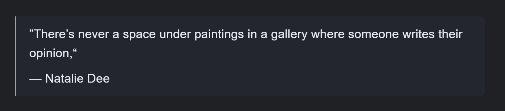

import { Aside } from '@astrojs/starlight/components';

Writing blog posts in markdown is great. It's simple and fast.  
Markdown is a simple way to write text using common symbols to add things like \*\***bold**\*\*, \**italics*\*, or lists.  
Here's an overview of things you can achieve with Markdown: <a href="https://www.markdownguide.org/cheat-sheet/" target="_blank">Markdown Cheat Sheet</a>. 

Many webpages have their content written in markdown. There are many frameworks that use markdown like Astro, Hugo or Eleventy. The markdown content gets transformed into HTML that is displayed on the website. But when you are building your own website you will also want to style that content, so how could that look like?

## On styling content written in markdown
There are multiple ways you can approach styling your own markdown content.

- Using a package such as [Tailwind Typography](https://github.com/tailwindlabs/tailwindcss-typography) with pre-defined styling. Here's a [list of other drop-in CSS frameworks](https://github.com/swyxio/spark-joy/blob/master/README.md#drop-in-css-frameworks) you could use.
- Writing your own CSS.

Because I'd like my written content design to fit into the rest of the page I like to write my own styles. This is a bit of work though as we have to write styling for the various elements that markdown allows us to create.

Part of your styling such as `<p>` and `<h1>` elements might already have styling defined in your main CSS file that you can continue to use. But markdown content can also include **images**, **code blocks**, **quotes**, **tables** and more which we have to take care of.


## Styling the different elements
I will assume that the html should look something like this:

```html
<main>
    <article class="markdown-container">
        <slot /> <!-- //Markdown content inserted  here -->
    </article>
</main>
```

To this container we want to apply some styling as well as on all its children like this:

```css
.markdown-container {
    width: min(100% - 2rem, 700px);
}
.markdown-container > *:not(:first-child) {
    margin-block-start: 1.5em;
}
```

The markdown-container will have a max width of `700px`, or smaller for mobile devices. The keyword `min` selects the smaller amount. Instead of a max-width of `700px` you could use `75ch`, which would count characters.  
You might also want to make the container into a flex-box or grid depending on how you want to control your layout.


To space the elements I give all direct children of the container except for the first a margin-top of `1.5em`.

### Paragraph  `<p>`
We want the content that gets brought in through markdown to match the already existing content of the website. Which means we want to already have defined CSS variables in the root and applied styling to elements such as the body for text. I have explained how CSS variables should be used here: [CSS Variables](/css/variables).

Which means we already should have something similar to this:

```css
:root {
    --variable-1: ...
}

body {
    font-family: sans-serif, "Source Sans Pro", "Helvetica", ui-sans-serif, system-ui;
    line-height: 1.5;
    color: hsl(224, 20%, 97%);
    background-color: hsl(216, 28%, 7%);
}
```
This should take care of all `<p>` elements without needing to further style them explicitly.


### Section Headings `<h1>, <h2> ..`

Section headings are of major importance since they got used often and are important for keeping an overview.

Section headings are quite important since they get used often and help users navigate your pages.

```css
h1, h2, h3, h4, h5, h6 {
    margin-block-start: 2em;
    overflow-wrap: anywhere;
}
```

You might also want to set a `line-height`, `font-weight` and `color` for your section heading elements.

The `font-size` for each section heading should also be set, it makes sense to do this via CSS variables to make heading sizes uniform. If you are looking for specific font sizes to use check out [CSS variables](/css/variables).

### Images `` & `<picture>`

```css
img, picture {
    max-width: 100%;
    height: auto;
    border-radius: 0.25rem;
    margin-inline: auto;
    display: block;
}
```

`object-fit: scale-down` makes sure we can always see the full picture. By setting `max-width` and `height` we ensure proper sizing of the image. `border-radius` to set slightly rounded corners.

If you are using a framework like Astro, to center the image you will want to add `margin-inline: auto` and `display: block` to center the image.

---

### Lists `<ol>` & `<ul>`

Styling ordered and unordered lists only requires a few lines of CSS.

```css
ol, ul {
    margin-left: 1em;
}
li {
    overflow-wrap: anywhere;
}
```

We apply some margin on the left to give room for the `list-style` elements such as the numbers or dot. `overflow-wrap: anywhere` makes sure that the content of the lists doesn't overflow.

### Quote `<blockquote>`

To style quotes which can be written by using `>` at the start of the line we use this:

```css
blockquote {
    border-inline-start: 1px solid red;
    padding: 0.75rem 1rem 0.75rem 1.25rem;
    border-radius: 0 0.5rem 0.5rem 0;
    background-color: grey;
}
blockquote footer {
    margin-top: 0.5em;
}
```

Since I sometimes want to add to sort of attribution to who the quote is from I write my markdown like this:

```md
> "There's never a space under paintings in a gallery where someone writes their opinion,"
> <footer>— Natalie Dee</footer>
```

On my personal blog page it would then look like this:



To position the last line slightly lower I added some `margin-top` for the footer like shown above.

### Table `<table>`

Tables are great, but they need a few more lines of CSS for styling.

```css
table {
    display: block;
    max-width: 100%;
    border-collapse: collapse;
    border: 2px solid green;
    border-spacing: 0;
    margin-inline: auto;
    overflow: auto;
}
td {
    border: 1px solid green;
    padding: 0.5rem 1rem;
}
th {
    border: 1px solid green;
    padding: 0.75rem 1rem;
    font-weight: 600;
}
table tbody tr:nth-child(odd) {
    background-color: grey; //different background color applied to every second row
}
```

To gain better control of the table apply `display: block`, otherwise it's hard to make them responsive. Some lines are exclusive to styling tables like `border-collapse`and `border-spacing`, see the [mdn web docs](https://developer.mozilla.org/en-US/docs/Learn/CSS/Building_blocks/Styling_tables) for more information.

`th` is the first row of the table, here we apply a stronger `font-weight` and larger spacing to make the first row stand out as the structural element.

`table tbody tr:nth-child(odd)` is used to apply styles to every second row of the table. I use this to make large tables easier to read by applying a slightly different background to every other row.

Note: Make sure the parent container (`markdown-container`) has a max-width set, or the table might make the page grow horizontally instead of being scrollable.

### Code & Code Block `<code>` & `<pre>`

Code can be a single word within a sentence or multiple lines long.

```css
code,
code span,
pre {
    border-radius: 4px;
    color: var(--color-side-accent);
    font-family: Menlo, monospace; // replace with your font
    overflow: auto;
    max-width: 100%;
    background-color: blue !important;
}
code {
    background-color: blue !important;
    font-size: var(--variable-font-size);
}
pre {
    padding: 0.75rem 1rem;
    tab-size: 2;
}
```

<Aside>
This has been tested on pages built using Astro. Other frameworks or libraries might need slight adjustments regarding their selectors.
</Aside>

To make code easily identifiable and readable we apply a different `background-color`, `color` and a monospaced font. To ensure proper sizing apply `max-width` and if there's remaining content, since code does not line break, we want to add `overflow: auto` which makes it scrollable if needed.

`tab-size` sets the width of a tab character, use `tab-size: 2` or `tab-size: 4`.

<Aside>
Since I am using Astro Starlight the code blocks displayed on this website are enhanced with different colored highlighting using the "Astro Expressive Code" package.  
Just using the above CSS snippet will not result in colored highlighting.
</Aside>

### Thematic Break `<hr>`

The thematik break element `---` which is commonly just a horizontal line can be styled the following:

```css
hr {
    border: 0;
    border-bottom: 1px solid yellow;
}
```

## Wrap-Up
By applying the styles above you make sure that your site is responsive and looks solid.

<Aside>
My most modern implementation of this in an Astro project that uses CSS variables can be found on [my personal blog repository here](https://github.com/BryanHogan/bryanhogan/blob/main/src/styles/markdown.css).

If there is anything confusing or not working for you please contact me at one of the places linked [here](https://bryanhogan.com/socials).
</Aside>

---

<details>

<summary>Sources & References</summary>

- Best practices for section heading elements: https://developer.mozilla.org/en-US/docs/Web/HTML/Element/Heading_Elements
- Markdown.css in the Astro Starlight project which I used for reference: https://github.com/withastro/starlight/blob/main/packages/starlight/style/markdown.css
- Plans for the future of this page: Update it and provide code example of with as implemented on [my personal blog](https://github.com/BryanHogan/bryanhogan/blob/main/src/styles/markdown.css) and without CSS variables.

</details>
