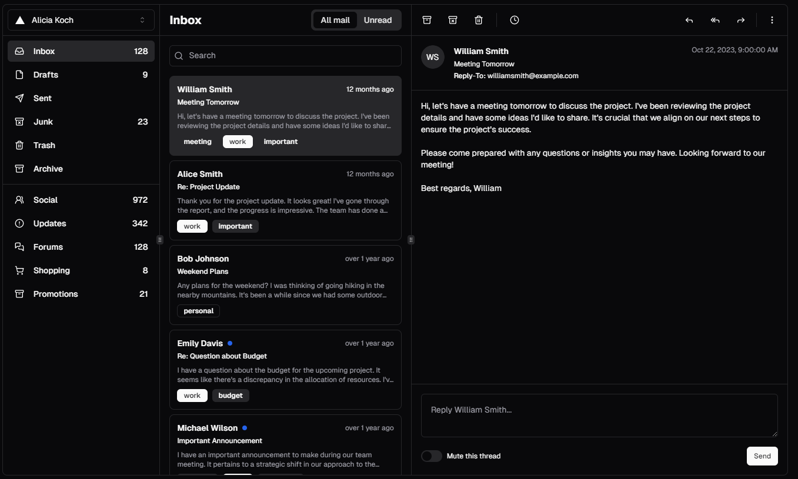

import { LinkCard, CardGrid } from '@astrojs/starlight/components';

There are some rules we can follow to make usability and the look of our websites far better. It's a large field but by following just a few basic rules we can already achieve a lot.

## The basics of a good website design

Goal of the website is to make the interaction with the website itself pleasant. The user usually arrives at the website with a specific goal, our task is to make achieving that goal as easy as possible.

The three major aspects of any element are:

- Size
- Color
- Position

Important elements are large, stand out with their color and are positioned in a way that quickly catches the user's eyes. The least important elements are the opposite.

These rules sound very intuitive, since we see them every day, multiple times, and they just make sense, but we need to be actively aware of these when we design.  
Which means in a design we want to define rules. Rules for the sizes, color and spacing that we are going to use throughout the design. How a implementation of these looks into CSS I've described on the [CSS variables pages](/css/variables/).

There are also general design laws we want to follow. Like the law of proximity, objects that are near to each other will be perceived as a group. Or the Von Restorff Effect (The Isolation Effect), when similar objects are present, the one that differs stands out and is more likely to be remembered.  
[lawsofux.com](https://lawsofux.com/) has a great collection of these with visual examples.

Design from the user's perspective.  
Use already existing knowledge and assumptions they have. This can be assumptions regarding how a website's layout works, how certain elements should work when you click them or what certain icons stand for.  
But this can also be applied to color and the emotional connection to these, for example most irreversible delete actions use red in their warning message.

Use already existing designs as a base.  
Don't try  to innovate the wheel, that'd be confusing and thus unpleasant to the user.
[html5up.net](https://html5up.net/) has great website examples for you to copy.  
Also UI frameworks like [daisyui](https://daisyui.com/) or [shadcn](https://ui.shadcn.com/) are great sources for inspiration.

Resources to dive deeper into UI & UX that I can highly recommend:

<CardGrid>
    <LinkCard
        title="Foundations of a great UI"
        href="https://m3.material.io/foundations"
        description="What makes a great user interface, from accessibility to essential patterns for layout and interaction, by Material Design (Google)."
        target="_blank"
    />
    <LinkCard
        title="Laws of UX"
        href="https://lawsofux.com/"
        description="Laws of UX is a collection of best practices that designers can consider when building user interfaces."
        target="_blank"
    />
    <LinkCard
        title="Nielson Norman Group on UX"
        href="https://www.nngroup.com/articles/#popular"
        description="They create good content on UX design and usability."
        target="_blank"
    />
</CardGrid>

## Example

Here's an example from the shadcn website using their components:

Elements are grouped together by placing them near each other. These groups are emphasized through boundaries and by having them follow similar shapes.  
What groups exist and what their respective functions are becomes obvious fast, even though the design is using almost exclusively greyscale.

The active mail gets highlighted by using color but in a way that works even for people with color blindness. The user can build a quick mental model of how this software would work, the main navigation is on the left, mail section is in the middle and mail is shown on the right. The user's eyes go from left to right, they do not need to jump and are instead lead smoothly through the page.

---

Sources & References

- Laws of UX: https://lawsofux.com/
- Information on building user interfaces: https://m3.material.io/foundations
- Good example pages with downloadable HTML, CSS and JavaScript code: https://html5up.net/
- CSS / UI / Component frameworks that include good example components: https://daisyui.com/ and https://ui.shadcn.com/ and https://tailwindcss.com/
- Graphic design psychology: https://youtu.be/-5jSCHZIHlg

