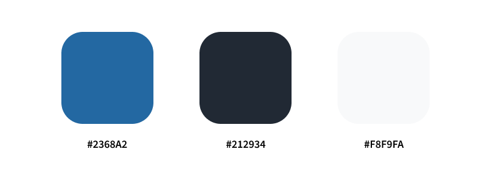
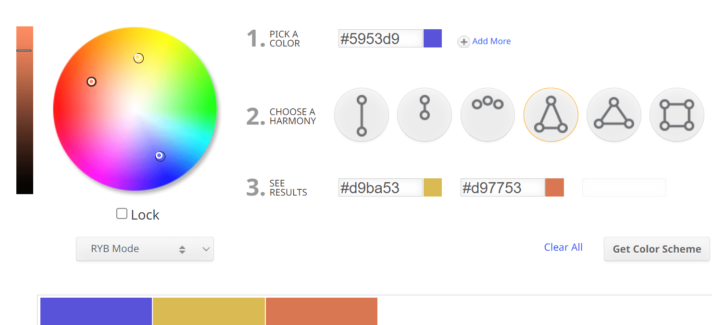

How should you pick colors for your website?

## Picking colors for your website

Start by selecting your main color first, this is going to be your base color. This color should be a somewhat vibrant one and **not** grey/white/black.

Then select your neutral colors. Select one light, near white, and one dark color, near black. 

You now have 1 vibrant and 2 neutral colors.

How these three colors could look:

That's almost all we need. Select different levels of shades for your selected colors, so color that lies in between your 3 main colors. We use these when we need more gradual steps between our colors and less strong contrasts. Like when you need a color that's just a bit lighter or darker than another one, this is when we use these shades.

Stay simple with your colors in the beginning. It's always possible to add more colors later.

Your color selection should be implemented as CSS variables, a description of how that would look is on the [CSS Variables page](/css/variables).

### 60 / 30 / 10 Rule

A popular rule for applying colors is the 60 / 30 / 10 rule.

This rule states to use 60% of color one, 30% of color two, and 10% of color three.

### Accents

In addition to your primary vibrant color you might want some other accents.

One way to find colors that compliment each other is by using **color wheels**. Here you can choose what kind of harmony of colors you want and then get some recommendations. I use [sessions.edu](https://www.sessions.edu/color-calculator/) and [color.adobe](https://color.adobe.com/create/color-wheel).

Do not try to perfectly calculate your colors though, there is no reason to use the exact colors a tool like a color wheel gives you.

Another way to find complementary  colors is by using palette generators. I use [coolors.co](https://coolors.co/) and [mycolor.space](https://mycolor.space/).

Just like for the color wheel, these can be helpful for finding general directions of color you could use when you need to select accents colors.

### Accessibility

Of major importance regarding colors is accessibility. The colors you use should improve the usability of your website, not hinder it. Make sure that your elements have strong enough contrast. Be aware that your users might have totally different screens compared to you, your users might also have some visual impairment or color blindness. Regardless of these conditions, your website should work well for these groups.

Test your colors contrast ratio by using something like [siegemedia's contrast ratio rool](https://www.siegemedia.com/contrast-ratio). Aim for a score of at least 7+.  
You can also check by looking at your visual design in greyscale.  
Also test your website with the browsers built in lighthouse test. 

### Building the full palette

- how to find color for each step?`Find middle, keep finding middle between two colors

- Then in a mainly dark based color scheme: When using the accent we go into the darker direction with each step (left in image example). Go from base which is in the middle at 500 into left, higher number thus darker accent
- And when using white based one we use ligth steps(right in image example), 
- In a website where we can swap between light and dark mode we would define these colors as variable so we could then apply accent 100 for a softer accent in a light based design or in dark mode accent 900 in for a dark based one

- Example shows: Ensure stronger contract by choosing the opposite side always
- Unsure small steps by swapping to the less contrasting color, ensure design has some effect regardless of dark or light mode

### Further Accents

Sources & References

- Color palette generators:
    - https://coolors.co/
    - https://mycolor.space/
- Color wheels:
    - https://color.adobe.com/create/color-wheel
    - https://www.sessions.edu/color-calculator/
- Mater Design's (Google) guide on selecting colors: https://m3.material.io/styles/color/system/overview
- Guide in building color palette for website: https://www.refactoringui.com/previews/building-your-color-palette
- W3Schools page on accessibility color contrast: https://www.w3schools.com/accessibility/accessibility_color_contrast.php
- Check contrast ratio: https://www.siegemedia.com/contrast-ratio

